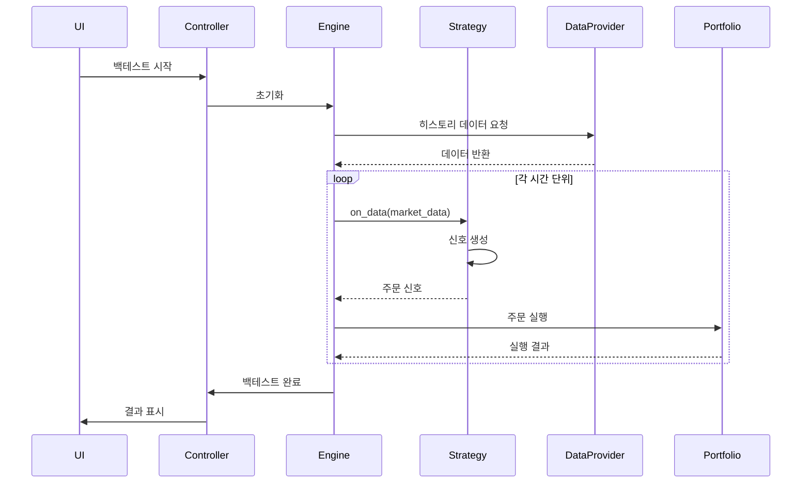
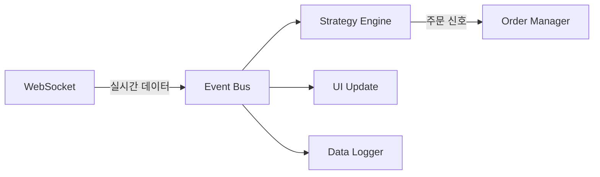

# 시스템 아키텍처 문서

## 1. 개요

키움증권 REST API 백테스팅 시스템은 확장성과 유지보수성을 고려한 계층적 아키텍처로 설계되었습니다. DDD(Domain-Driven Design)와 Clean Architecture 원칙을 따르며, 플러그인 시스템을 통해 새로운 기능을 쉽게 추가할 수 있습니다.

## 2. 아키텍처 개요

### 2.1 계층 구조

```
┌─────────────────────────────────────────────────────────┐
│                  Presentation Layer                      │
│                                                          │
│  - PyQt5 UI Components                                  │
│  - REST API Endpoints (Optional)                        │
│  - WebSocket Server (Real-time updates)                 │
└─────────────────────────────────────────────────────────┘
                              ↓
┌─────────────────────────────────────────────────────────┐
│                  Application Layer                       │
│                                                          │
│  - Backtest Controller                                  │
│  - Strategy Manager                                     │
│  - Report Generator                                     │
│  - System Coordinator                                   │
└─────────────────────────────────────────────────────────┘
                              ↓
┌─────────────────────────────────────────────────────────┐
│                    Domain Layer                          │
│                                                          │
│  - Strategy Engine                                      │
│  - Portfolio Manager                                    │
│  - Risk Manager                                         │
│  - Order Management System                              │
│  - Market Data Models                                   │
└─────────────────────────────────────────────────────────┘
                              ↓
┌─────────────────────────────────────────────────────────┐
│                Infrastructure Layer                      │
│                                                          │
│  - Kiwoom API Client                                    │
│  - Data Collection Module                               │
│  - Database Repository                                  │
│  - Cache Manager                                        │
│  - Message Queue                                        │
│  - Logger                                               │
└─────────────────────────────────────────────────────────┘
```

### 2.2 의존성 규칙

- 상위 계층은 하위 계층에 의존하지만, 인터페이스를 통해서만 의존
- 하위 계층은 상위 계층을 알지 못함
- 도메인 계층은 순수 비즈니스 로직만 포함
- 인프라 계층의 변경이 도메인 계층에 영향을 주지 않음

## 3. 핵심 컴포넌트

### 3.1 Domain Layer Components

#### Strategy Engine
```python
# 전략 실행의 핵심 로직
src/domain/strategy/
├── interfaces.py      # IStrategy, IIndicator
├── engine.py         # StrategyEngine
├── context.py        # StrategyContext
└── signals.py        # Signal, OrderSignal
```

#### Portfolio Manager
```python
# 포트폴리오 상태 관리
src/domain/portfolio/
├── portfolio.py      # Portfolio
├── position.py       # Position
├── transaction.py    # Transaction
└── performance.py    # PerformanceTracker
```

#### Risk Manager
```python
# 리스크 평가 및 관리
src/domain/risk/
├── interfaces.py     # IRiskManager
├── manager.py        # RiskManager
├── limits.py         # RiskLimits
└── metrics.py        # VaR, MaxDrawdown
```

### 3.2 Infrastructure Layer Components

#### API Client
```python
# 키움 REST API 통합
src/infrastructure/api/
├── client.py         # KiwoomAPIClient
├── auth.py          # OAuth2Manager
├── endpoints.py     # API 엔드포인트 정의
└── models.py        # Request/Response 모델
```

#### Cache System
```python
# 계층적 캐싱 시스템
src/infrastructure/cache/
├── interfaces.py     # ICache
├── memory.py        # InMemoryCache (L1)
├── redis.py         # RedisCache (L2)
└── file.py          # FileSystemCache (L3)
```

## 4. 데이터 흐름

### 4.1 백테스트 실행 흐름



### 4.2 실시간 데이터 처리



## 5. 플러그인 아키텍처

### 5.1 플러그인 인터페이스

```python
class IPlugin(ABC):
    """플러그인 기본 인터페이스"""
    
    @property
    @abstractmethod
    def name(self) -> str:
        """플러그인 이름"""
        pass
    
    @property
    @abstractmethod
    def version(self) -> str:
        """플러그인 버전"""
        pass
    
    @abstractmethod
    def initialize(self, context: PluginContext) -> None:
        """플러그인 초기화"""
        pass
    
    @abstractmethod
    def get_hooks(self) -> Dict[str, Callable]:
        """훅 포인트 정의"""
        pass
```

### 5.2 플러그인 타입

1. **Strategy Plugins**: 새로운 거래 전략
2. **Indicator Plugins**: 기술적 지표
3. **Data Source Plugins**: 추가 데이터 소스
4. **Risk Model Plugins**: 리스크 평가 모델
5. **Report Plugins**: 커스텀 리포트

## 6. 비동기 처리 아키텍처

### 6.1 동시성 모델

```python
# 비동기 작업 관리
class AsyncTaskManager:
    def __init__(self):
        self.executor = ThreadPoolExecutor(max_workers=10)
        self.loop = asyncio.get_event_loop()
        
    async def run_concurrent_tasks(self, tasks: List[Callable]):
        futures = []
        for task in tasks:
            if asyncio.iscoroutinefunction(task):
                futures.append(task())
            else:
                futures.append(
                    self.loop.run_in_executor(self.executor, task)
                )
        
        return await asyncio.gather(*futures)
```

### 6.2 이벤트 기반 통신

```python
# 이벤트 버스 구현
class EventBus:
    def __init__(self):
        self._subscribers: Dict[str, List[Callable]] = defaultdict(list)
        
    def subscribe(self, event_type: str, handler: Callable):
        self._subscribers[event_type].append(handler)
        
    async def publish(self, event_type: str, data: Any):
        handlers = self._subscribers.get(event_type, [])
        tasks = [handler(data) for handler in handlers]
        await asyncio.gather(*tasks, return_exceptions=True)
```

## 7. 데이터베이스 스키마

### 7.1 주요 테이블

```sql
-- 전략 실행 이력
CREATE TABLE strategy_runs (
    id UUID PRIMARY KEY,
    strategy_name VARCHAR(255),
    start_date TIMESTAMP,
    end_date TIMESTAMP,
    initial_capital DECIMAL(15, 2),
    final_capital DECIMAL(15, 2),
    parameters JSONB,
    created_at TIMESTAMP DEFAULT CURRENT_TIMESTAMP
);

-- 거래 내역
CREATE TABLE transactions (
    id UUID PRIMARY KEY,
    run_id UUID REFERENCES strategy_runs(id),
    symbol VARCHAR(20),
    side VARCHAR(10),
    quantity INTEGER,
    price DECIMAL(10, 2),
    commission DECIMAL(10, 2),
    executed_at TIMESTAMP
);

-- 성과 지표
CREATE TABLE performance_metrics (
    id UUID PRIMARY KEY,
    run_id UUID REFERENCES strategy_runs(id),
    metric_name VARCHAR(100),
    metric_value DECIMAL(15, 6),
    calculated_at TIMESTAMP DEFAULT CURRENT_TIMESTAMP
);
```

## 8. 데이터 수집 모듈 (Phase 6 구현 완료)

### 8.1 마켓 데이터 모델

```python
@dataclass
class MarketData:
    """기본 시장 데이터"""
    symbol: str
    timestamp: datetime
    data_type: str
    source: str

@dataclass
class Quote(MarketData):
    """현재가 데이터"""
    price: Decimal
    prev_close: Decimal
    change: Decimal
    change_rate: Decimal
    volume: int
    trade_value: Decimal
    open_price: Decimal
    high_price: Decimal
    low_price: Decimal
```

### 8.2 KiwoomMarketDataProvider 아키텍처

```python
class KiwoomMarketDataProvider(IMarketDataProvider):
    """키움증권 마켓 데이터 제공자"""
    
    # 연결 관리
    async def connect(self) -> bool
    async def disconnect(self) -> None
    
    # 실시간 구독
    async def subscribe(self, symbols: List[str]) -> bool
    async def unsubscribe(self, symbols: List[str]) -> bool
    
    # 데이터 수집
    async def get_quote(self, symbol: str) -> Quote
    async def get_ohlcv(self, symbol: str) -> List[OHLCV]
    async def get_multiple_quotes(self, symbols: List[str]) -> List[Quote]
    
    # 대용량 데이터 처리
    async def get_historical_data(self, symbol: str, start_date: datetime, end_date: datetime) -> AsyncGenerator[List[DataPoint], None]
```

### 8.3 데이터 정규화 시스템

```python
class DataNormalizer:
    """API 응답 정규화"""
    
    def normalize_quote_data(self, symbol: str, raw_data: Dict[str, Any]) -> Quote:
        """키움 API 현재가 응답을 Quote 모델로 변환"""
        
    def _parse_decimal(self, value: str) -> Decimal:
        """쉼표 제거 후 Decimal 변환"""
        return Decimal(value.replace(",", ""))
        
    def _calculate_prev_close(self, current_price: Decimal, change: Decimal, sign: str) -> Decimal:
        """키움 API 부호 기반 전일종가 계산"""
```

### 8.4 캐싱 및 성능 최적화

- **TTL 기반 캐싱**: 5초 캐시로 API 호출 최소화
- **배치 요청**: 다중 종목 동시 요청으로 효율성 향상
- **연속조회**: 대용량 데이터 페이징 처리
- **비동기 처리**: asyncio 기반 동시성 처리

## 9. 백테스트 엔진 아키텍처 (Phase 7 - 구현 완료)

### 9.1 이벤트 기반 백테스트 아키텍처

```python
class BacktestEngine:
    """이벤트 기반 백테스트 엔진"""
    
    def __init__(
        self,
        config: BacktestConfig,
        strategy: IStrategy,
        data_provider: IMarketDataProvider,
        portfolio_manager: PortfolioManager
    ):
        self.event_queue: asyncio.Queue[BacktestEvent] = asyncio.Queue()
        self.executor = BacktestExecutor()
    
    async def run(self) -> BacktestResult:
        """백테스트 실행"""
        await self._initialize()
        await self._run_event_loop()
        return await self._generate_result()
```

### 9.2 포트폴리오 관리 시스템

```python
class PortfolioManager:
    """포트폴리오 관리자"""
    
    def __init__(self, portfolio: Portfolio, data_provider: IMarketDataProvider):
        self.portfolio = portfolio
        self.risk_validator = RiskValidator()
        self.position_tracker = PositionTracker()
    
    async def execute_buy_order(
        self,
        symbol: str,
        quantity: int,
        price: Optional[Decimal] = None,
        validate_risk: bool = True
    ) -> Tuple[bool, str, Optional[Position]]:
        """매수 주문 실행 (리스크 검증 포함)"""
```

### 9.3 성과 지표 계산 시스템

```python
class PerformanceCalculator:
    """성과 지표 계산기"""
    
    def calculate_sharpe_ratio(self, risk_free_rate: Decimal = Decimal("0.02")) -> Decimal
    def calculate_sortino_ratio(self, target_return: Decimal = Decimal("0.0")) -> Decimal
    def calculate_calmar_ratio(self) -> Decimal
    def calculate_max_drawdown(self) -> Tuple[Decimal, int, int]
    def calculate_value_at_risk(self, confidence_level: Decimal = Decimal("0.95")) -> Decimal
    def calculate_conditional_value_at_risk(self, confidence_level: Decimal = Decimal("0.95")) -> Decimal
```

### 9.4 거래 비용 모델

```python
class TransactionCostModel:
    """한국 시장 특화 거래 비용 모델"""
    
    # 수수료 구조
    commission_tiers = [
        CommissionTier(Decimal("1000000"), Decimal("0.002")),     # 100만원까지 0.2%
        CommissionTier(Decimal("10000000"), Decimal("0.0015")),   # 1000만원까지 0.15%
        CommissionTier(Decimal("100000000"), Decimal("0.001")),   # 1억원까지 0.1%
        CommissionTier(None, Decimal("0.0005"))                    # 1억원 초과 0.05%
    ]
    
    # 세율
    tax_rates = {
        "stock": Decimal("0.003"),      # 일반 주식 0.3%
        "etf": Decimal("0.0008"),       # ETF 0.08%
        "reit": Decimal("0.0035")       # 리츠 0.35%
    }
    
    def calculate_total_cost(self, price, quantity, transaction_type) -> CostComponents
```

## 10. Trading UI 아키텍처 (Phase 8 - 진행 중)

### 10.1 PyQt5 기반 UI 구조

```
┌─────────────────────────────────────────────────────┐
│                 TradingApplication                   │
│  - 전체 어플리케이션 라이프사이클 관리               │
│  - 테마 및 설정 관리                                │
│  - 예외 처리                                        │
└─────────────────────┬───────────────────────────────┘
                      │
┌─────────────────────▼───────────────────────────────┐
│                    MainWindow                        │
│  - 메뉴바, 툴바, 상태바                             │
│  - 도킹 위젯 관리                                   │
│  - 중앙 탭 위젯                                     │
└─────────┬───────────┬──────────────┬────────────────┘
          │           │              │
    ┌─────▼─────┐┌────▼────┐┌───────▼──────┐
    │ Strategy  ││Backtest ││  Chart      │
    │ List      ││ Config  ││  Widgets    │
    └───────────┘└─────────┘└──────────────┘
```

### 10.2 위젯 시스템

- **StrategyListWidget**: 전략 목록 및 관리
- **BacktestConfigWidget**: 백테스트 설정
- **ProgressWidget**: 실행 진행률 표시
- **ChartWidget**: 가격 차트 (pyqtgraph)
- **EquityCurveWidget**: 자산 곡선
- **MetricsTableWidget**: 성과 지표 테이블

### 10.3 시그널/슬롯 아키텍처

```python
# 전략 선택 시
strategy_list.strategy_selected.connect(self.on_strategy_selected)

# 백테스트 시작 시
backtest_btn.clicked.connect(self.start_backtest)

# 진행률 업데이트
engine.progress_updated.connect(progress_widget.update_progress)
```

## 11. 보안 아키텍처

### 11.1 인증 및 권한

```python
# API 키 관리 (Phase 4 구현 완료)
class CredentialManager:
    def __init__(self):
        self._fernet = Fernet(self._get_or_create_key())
        
    def save_credentials(self, credentials: Credentials) -> None:
        """암호화된 자격증명 저장"""
        
    def load_credentials(self) -> Optional[Credentials]:
        """복호화된 자격증명 로드"""
```

### 9.2 데이터 암호화

- API 키: Fernet 기반 대칭 암호화
- 민감 데이터: AES-256 암호화
- 통신: HTTPS 필수
- 로그: 개인정보 마스킹

## 10. 성능 최적화 전략

### 10.1 캐싱 전략

1. **L1 Cache (Memory)**: 자주 접근하는 데이터
   - TTL: 5분
   - 크기: 1GB
   
2. **L2 Cache (Redis)**: 세션 간 공유 데이터
   - TTL: 1시간
   - 크기: 10GB
   
3. **L3 Cache (File)**: 히스토리 데이터
   - TTL: 무제한
   - 크기: 100GB

### 10.2 데이터 처리 최적화 (Phase 6 구현됨)

```python
# 키움 API 특화 최적화
class KiwoomMarketDataProvider:
    async def get_multiple_quotes(self, symbols: List[str]) -> List[Quote]:
        """배치 요청으로 다중 종목 효율적 처리"""
        
    async def get_historical_data(self, symbol: str, start_date: datetime, end_date: datetime) -> AsyncGenerator[List[DataPoint], None]:
        """연속조회로 대용량 데이터 페이징 처리"""
        
    async def get_latest_data(self, symbol: str, data_type: str) -> Optional[DataPoint]:
        """TTL 기반 캐싱으로 API 호출 최소화"""
```

## 11. 확장 포인트

### 11.1 새로운 증권사 API 추가

1. `IMarketDataProvider` 인터페이스 구현
2. API 어댑터 클래스 작성
3. `DataSourceRegistry`에 등록
4. 설정 파일에 추가

### 11.2 새로운 전략 추가

1. `IStrategy` 인터페이스 구현
2. `plugins/strategies/` 디렉토리에 배치
3. 전략 메타데이터 정의
4. 테스트 케이스 작성

### 11.3 새로운 리포트 타입

1. `IReportGenerator` 구현
2. 템플릿 작성 (Jinja2)
3. 리포트 레지스트리 등록

## 12. 모니터링 및 로깅

### 12.1 로깅 구조

```yaml
# logging.yaml
loggers:
  api:
    level: INFO
    handlers: [api_file]
  strategy:
    level: DEBUG
    handlers: [strategy_file, console]
  risk:
    level: WARNING
    handlers: [risk_file, alert]
  data_collection:  # Phase 6 추가
    level: DEBUG
    handlers: [data_file, console]
```

### 12.2 메트릭 수집

- API 호출 횟수 및 지연시간
- 전략 실행 시간
- 메모리 사용량
- 캐시 히트율 (Phase 6에서 5초 TTL 구현)
- 데이터 정규화 성공률
- 배치 요청 효율성

## 13. 배포 아키텍처

### 13.1 로컬 배포

```bash
# Docker Compose 구성
services:
  app:
    build: .
    environment:
      - REDIS_URL=redis://redis:6379
  redis:
    image: redis:alpine
  postgres:
    image: postgres:13
```

### 12.2 프로덕션 고려사항

- 로드 밸런싱
- 자동 스케일링
- 백업 전략
- 모니터링 대시보드

---

**버전**: 1.0.0  
**작성일**: 2024-01-12  
**작성자**: System Architect