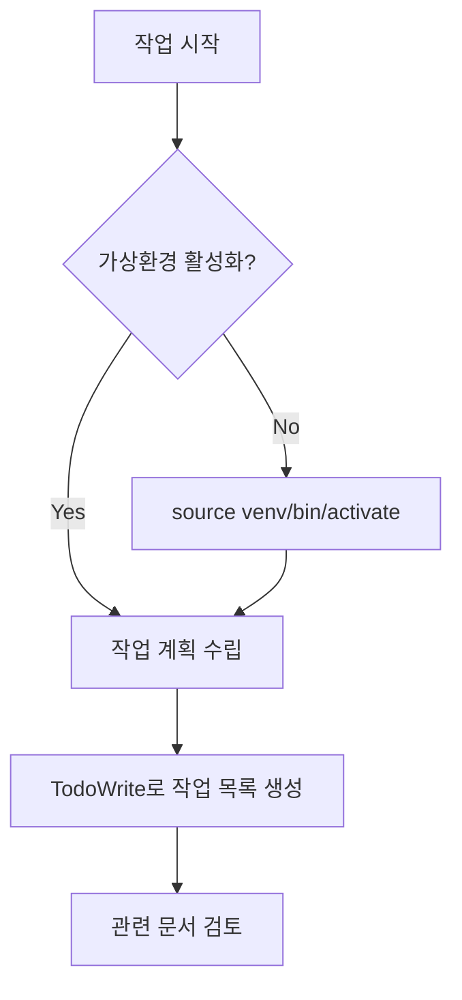

# 작업 프로세스 가이드

## 1. 개요

이 문서는 키움증권 REST API 백테스팅 시스템 개발 시 따라야 할 표준 작업 프로세스를 정의합니다. 모든 개발 작업은 이 프로세스를 준수해야 합니다.

## 2. 표준 작업 프로세스

### 2.1 작업 시작 전



### 2.2 개발 프로세스

모든 개발 작업은 다음 단계를 따릅니다:

#### 1. **계획 (Planning)**
```
1. 작업 범위 정의
2. TodoWrite 도구로 작업 목록 생성
3. 관련 문서 (ARCHITECTURE.md, API_INTEGRATION.md 등) 검토
4. 필요한 인터페이스/모델 식별
```

#### 2. **구현 (Implementation)**
```
1. 테스트 코드 작성 (TDD)
2. 실제 코드 구현
3. 코드 스타일 검사 (black, isort, flake8)
4. 타입 체크 (mypy)
```

#### 3. **테스트 (Testing)**
```
1. 단위 테스트 실행: pytest tests/unit/
2. 통합 테스트 실행: pytest tests/integration/
3. 커버리지 확인: pytest --cov=src
4. 테스트 실패 시 → 오류 수정 → 재테스트
```

#### 4. **문서화 (Documentation)**
```
1. 코드 내 docstring 작성/업데이트
2. 관련 문서 업데이트:
   - PROJECT_STATUS.md: 진행 상황 업데이트
   - CLAUDE.md: 새로운 규칙/패턴 추가
   - 기능별 문서: 필요시 업데이트
3. 변경 이력 기록
```

## 3. 작업별 상세 프로세스

### 3.1 새로운 기능 개발

```bash
# 1. 작업 시작
source venv/bin/activate
git checkout -b feature/feature-name

# 2. 테스트 작성
# tests/unit/test_feature.py 생성

# 3. 구현
# src/module/feature.py 구현

# 4. 테스트 실행
pytest tests/unit/test_feature.py -v

# 5. 문제 발생 시
# → 오류 수정
# → 재테스트
# → 반복

# 6. 성공 시
# → 통합 테스트
pytest tests/integration/ -v

# 7. 코드 품질 검사
black src/module/feature.py
isort src/module/feature.py
flake8 src/module/feature.py
mypy src/module/feature.py

# 8. 문서 업데이트
# → PROJECT_STATUS.md 진행률 업데이트
# → 관련 문서 업데이트
```

### 3.2 버그 수정

```python
# 1. 버그 재현 테스트 작성
def test_버그_재현():
    """버그를 재현하는 테스트"""
    # 실패하는 테스트 작성
    pass

# 2. 버그 수정
# 코드 수정

# 3. 테스트 통과 확인
pytest tests/unit/test_bug_fix.py -v

# 4. 회귀 테스트
pytest tests/ -v

# 5. 문서 업데이트
```

### 3.3 API 통합

```python
# 1. API Mock 테스트 작성
async def test_api_integration_mock():
    """Mock을 사용한 API 통합 테스트"""
    pass

# 2. API 클라이언트 구현
class APIClient:
    """API 클라이언트 구현"""
    pass

# 3. Mock 테스트 실행
pytest tests/unit/test_api_client.py -v

# 4. 실제 API 테스트 (선택적)
pytest tests/integration/test_api_integration.py -v --use-real-api

# 5. 문서 업데이트
# → API_INTEGRATION.md 업데이트
```

### 3.4 UI 개발 (PyQt5)

```python
# 1. UI 위젯 테스트 작성
@pytest.fixture
def qapp():
    """QApplication fixture"""
    app = QApplication.instance()
    if app is None:
        app = QApplication(sys.argv)
    yield app

def test_strategy_list_widget(qapp):
    """전략 목록 위젯 테스트"""
    widget = StrategyListWidget()
    widget.load_strategies(sample_strategies)
    assert widget.topLevelItemCount() == len(sample_strategies)

# 2. 위젯 구현
class StrategyListWidget(QTreeWidget):
    """전략 목록 위젯"""
    # 시그널 정의
    strategy_selected = pyqtSignal(dict)
    strategy_double_clicked = pyqtSignal(dict)
    
    def __init__(self):
        super().__init__()
        self._init_ui()
        self._connect_signals()

# 3. 헤드리스 모드 테스트
QT_QPA_PLATFORM=offscreen pytest tests/unit/presentation/test_widgets.py -v

# 4. UI 실행 테스트
python test_ui.py  # 샘플 데이터로 UI 테스트

# 5. 메인 어플리케이션 통합
# run_trading_ui.py 업데이트
```

### 3.5 백테스트 엔진 개발

```python
# 1. 백테스트 설정 테스트
def test_backtest_config():
    """백테스트 설정 테스트"""
    config = BacktestConfig(
        start_date=datetime(2023, 1, 1),
        end_date=datetime(2023, 12, 31),
        initial_capital=Decimal("10000000")
    )
    assert config.initial_capital == Decimal("10000000")

# 2. 엔진 테스트
async def test_backtest_engine():
    """백테스트 엔진 테스트"""
    engine = BacktestEngine(config, strategy, data_provider, portfolio_manager)
    result = await engine.run()
    assert result.total_return != Decimal("0")

# 3. 성과 계산 테스트
def test_performance_calculator():
    """성과 지표 계산 테스트"""
    calculator = PerformanceCalculator(
        initial_capital=Decimal("10000000"),
        portfolio_values=portfolio_values,
        daily_returns=daily_returns
    )
    sharpe = calculator.calculate_sharpe_ratio()
    assert sharpe > Decimal("-1")  # 합리적인 범위

# 4. 거래 비용 테스트
def test_transaction_costs():
    """거래 비용 모델 테스트"""
    cost_model = TransactionCostModel()
    costs = cost_model.calculate_total_cost(
        price=Decimal("70000"),
        quantity=100,
        transaction_type=TransactionType.BUY
    )
    assert costs.commission >= cost_model.min_commission
```

### 3.6 데이터 처리 모듈 개발

```python
# 1. 데이터 모델 정의 (TDD)
@dataclass
class Quote(MarketData):
    """현재가 데이터 모델"""
    price: Decimal
    # ... 필드 정의

# 2. 정규화기 테스트 작성
def test_normalize_quote_data():
    """API 응답 정규화 테스트"""
    raw_data = {"stck_prpr": "70,000"}  # 쉼표 포함
    normalizer = DataNormalizer()
    quote = normalizer.normalize_quote_data("005930", raw_data)
    assert quote.price == Decimal("70000")

# 3. 정규화기 구현
class DataNormalizer:
    def _parse_decimal(self, value: str) -> Decimal:
        """쉼표 제거 후 Decimal 변환"""
        return Decimal(value.replace(",", ""))

# 4. 데이터 제공자 테스트
async def test_market_data_provider():
    """마켓 데이터 제공자 테스트"""
    provider = KiwoomMarketDataProvider(mock_client)
    await provider.connect()
    quote = await provider.get_quote("005930")
    assert isinstance(quote, Quote)

# 5. 캐싱 및 배치 처리 테스트
async def test_caching_system():
    """캐싱 시스템 테스트"""
    # TTL 기반 캐시 동작 확인
    
async def test_batch_requests():
    """배치 요청 테스트"""
    # 다중 종목 동시 요청
```

## 4. 체크리스트

### 4.1 작업 완료 체크리스트

- [ ] 가상환경에서 작업했는가?
- [ ] 테스트를 먼저 작성했는가? (TDD)
- [ ] 모든 테스트가 통과하는가?
- [ ] 코드 커버리지가 70% 이상인가? (핵심 모듈)
- [ ] 코드 스타일 검사를 통과했는가?
- [ ] 타입 힌트를 추가했는가?
- [ ] Docstring을 작성했는가?
- [ ] 관련 문서를 업데이트했는가?
- [ ] PROJECT_STATUS.md를 업데이트했는가?
- [ ] 변경 이력을 기록했는가?

### 4.1.1 UI 개발 추가 체크리스트

- [ ] qapp fixture를 사용했는가?
- [ ] 헤드리스 모드에서 테스트했는가? (QT_QPA_PLATFORM=offscreen)
- [ ] 시그널/슬롯이 올바르게 연결되었는가?
- [ ] 위젯이 재사용 가능하게 설계되었는가?
- [ ] 다크 테마와 호환되는가?
- [ ] 비동기 작업이 UI를 블로킹하지 않는가?

### 4.1.2 백테스트 엔진 추가 체크리스트

- [ ] 이벤트 기반 처리가 구현되었는가?
- [ ] 거래 비용이 정확히 계산되는가?
- [ ] 성과 지표가 올바르게 계산되는가?
- [ ] 포지션 한도 검증이 작동하는가?
- [ ] 대용량 데이터 처리가 효율적인가?
- [ ] 진행률 추적이 구현되었는가?

### 4.1.3 데이터 처리 모듈 추가 체크리스트

- [ ] API 응답 정규화 로직이 구현되었는가?
- [ ] 필수/선택 필드 검증이 포함되었는가?
- [ ] 데이터 타입 변환 (쉼표 제거, 날짜 파싱)이 정확한가?
- [ ] 캐싱 시스템이 적절히 구현되었는가?
- [ ] 배치 요청 및 연속조회가 지원되는가?
- [ ] 에러 처리가 적절히 구현되었는가?

### 4.2 코드 리뷰 체크리스트

- [ ] 코드가 CODING_STANDARDS.md를 준수하는가?
- [ ] 테스트가 충분한가?
- [ ] 에러 처리가 적절한가?
- [ ] 성능 고려사항이 반영되었는가?
- [ ] 보안 이슈는 없는가?

## 5. 자동화 스크립트

### 5.1 테스트 실행 스크립트

```bash
#!/bin/bash
# scripts/run_tests.sh

echo "🧪 Running tests..."

# 1. 코드 스타일 검사
echo "📝 Checking code style..."
black --check src/ tests/
isort --check-only src/ tests/
flake8 src/ tests/

# 2. 타입 체크
echo "🔍 Type checking..."
mypy src/

# 3. 단위 테스트
echo "🧪 Running unit tests..."
pytest tests/unit/ -v

# 4. 통합 테스트
echo "🧪 Running integration tests..."
pytest tests/integration/ -v

# 5. 커버리지 리포트
echo "📊 Coverage report..."
pytest --cov=src --cov-report=html --cov-report=term

echo "✅ All tests completed!"
```

### 5.2 문서 업데이트 스크립트

```python
#!/usr/bin/env python
# scripts/update_docs.py

import os
from datetime import datetime

def update_project_status(task_completed):
    """PROJECT_STATUS.md 자동 업데이트"""
    # 구현 코드
    pass

def check_documentation():
    """문서 일관성 검사"""
    # 구현 코드
    pass

if __name__ == "__main__":
    check_documentation()
```

## 6. 트러블슈팅

### 6.1 일반적인 문제와 해결

#### 테스트 실패
```bash
# 1. 특정 테스트만 실행
pytest tests/unit/test_specific.py::test_function -v

# 2. 디버그 모드로 실행
pytest tests/unit/test_specific.py -v --pdb

# 3. 로그 출력 확인
pytest tests/unit/test_specific.py -v -s
```

#### 타입 에러
```bash
# 1. 특정 파일만 체크
mypy src/specific_module.py

# 2. 타입 무시 (최후의 수단)
# type: ignore
```

## 7. 모범 사례

### 7.1 커밋 메시지

```
feat(module): 새로운 기능 추가

- 기능 설명
- 테스트 추가
- 문서 업데이트

Closes #123
```

### 7.2 작업 분할

- 큰 작업은 작은 단위로 분할
- 각 단위별로 테스트-구현-문서화 사이클 완료
- PR은 500줄 이하로 유지

### 7.3 데이터 처리 모범 사례

- **정규화 우선**: API 응답은 즉시 표준 모델로 변환
- **검증 필수**: 모든 입력 데이터는 검증 후 사용
- **캐싱 활용**: 동일 요청은 캐시로 응답 시간 단축
- **배치 처리**: 다중 요청은 배치로 처리하여 효율성 향상
- **에러 복구**: 부분적 실패에 대한 복구 메커니즘 구현

### 7.4 테스트 작성 가이드

- **Mock 우선**: 외부 API는 Mock으로 테스트
- **경계값 테스트**: 빈 값, null, 잘못된 형식 등 테스트
- **비동기 패턴**: async/await 패턴 올바른 사용
- **픽스처 활용**: 공통 테스트 데이터는 fixture로 관리

### 7.5 지속적 개선

- 작업 중 발견한 개선사항은 즉시 문서화
- 반복되는 작업은 자동화 스크립트 작성
- 팀원 피드백 적극 반영
- 커버리지 목표: 핵심 비즈니스 로직 70% 이상

---

**버전**: 1.2.0  
**작성일**: 2025-07-12  
**최종 업데이트**: 2025-07-13  
**작성자**: Development Team

### 변경 이력
- v1.2.0 (2025-07-13): UI 개발 및 백테스트 엔진 워크플로우 추가
- v1.1.0 (2025-07-13): 데이터 처리 모듈 워크플로우 추가
- v1.0.0 (2025-07-12): 초기 버전